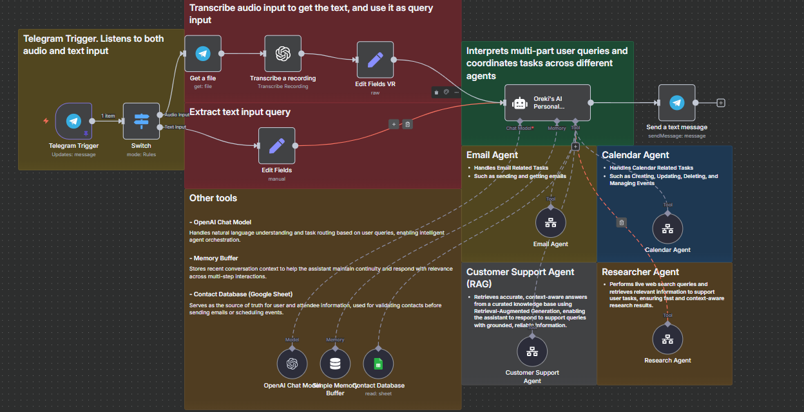

# 🤖 Personal AI Assistant Bot

A modular, multi-agent assistant built in **n8n** that interprets both **text and voice input**, intelligently routes tasks to specialized agents, and executes actions across email, calendar, research, and support workflows. Designed for scalability, context-awareness, and real-world productivity.

---

## 📸 Workflow Overview  
<!-- Add your image below this line -->
Watch the demo (Click the image below)!

Screenshots of the Workflow: 

---

## 🧠 Core Architecture

The system is composed of two main layers:

### 1. **Parent Agent (Orchestrator)**
- Listens for incoming **Telegram messages** (text or audio)
- Transcribes voice input using a speech-to-text module
- Analyzes the user’s intent using an AI model (e.g. Gemini or OpenAI)
- Detects **single or multi-task requests** and routes them to the appropriate child agents

### 2. **Child Agents (Modular Workflows)**
Each child agent is a standalone workflow designed to handle a specific task. The parent agent invokes one or more of these based on the user’s query.

---

## 🧩 Child Agent Breakdown

### 📧 Email Agent
- Validates recipient contact using a **Google Sheet database**
- Composes and sends emails using AI-generated content
- Supports dynamic subject lines, message bodies, and optional follow-ups
- Can be extended to include attachments, CC/BCC logic, or templated replies

**Example Query**:  
> “Send an email to John confirming the meeting details.”

---

### 📅 Calendar Agent
- Schedules events and meetings with proper **timezone handling**
- Validates attendees via the contact database unless both name and email are explicitly provided
- Can be expanded to support recurring events, reminders, or calendar syncing

**Example Query**:  
> “Book a call with Sarah next Tuesday at 3 PM.”

---

### 🛠️ Customer Support Agent (RAG)
- Uses **Retrieval-Augmented Generation** to answer support questions
- Pulls responses from a curated knowledge base (e.g. FAQs, documentation)
- Ensures answers are grounded and **not hallucinated**
- Output is strictly unaltered to maintain accuracy and trust

**Example Query**:  
> “What’s the refund policy for premium users?”

---

### 🔍 Researcher Agent
- Performs live web searches based on user queries
- Returns concise, relevant summaries with optional source links
- Can be extended to include deeper analysis, citations, or trend reports

**Example Query**:  
> “Find the top 3 AI workflow tools used in 2025.”

---

## 🛠️ Tech Stack

- **n8n** – Workflow orchestration  
- **Telegram Bot** – Input channel (text + voice)  
- **OpenAI / Gemini** – Intent analysis and agent logic  
- **Google Sheets** – Contact database  
- **Gmail / Calendar API** – Action execution  
- **RAG Stack** – Support knowledge base retrieval  
- **Web Search API** – Research agent backend

---

## 🎯 Use Cases

- Personal productivity assistant  
- AI-powered customer support bot  
- Internal team concierge for startups  
- Scalable agent framework for enterprise automation

---

## 📌 Notes

- The system is **modular**—new agents can be added without disrupting the core logic  
- Voice input is transcribed and processed identically to text  
- Contact validation ensures safe and accurate execution of email/calendar tasks  
- RAG agent responses are grounded in source material and never altered

---

> Built as part of my journey to become an AI automation specialist.  
> More workflows coming soon—huge thanks to Nate for sparking these ideas and pushing me to think modular.

